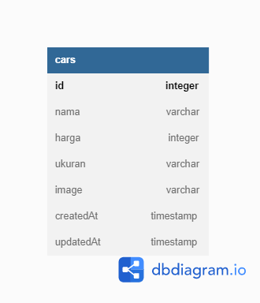

# Car Management Dashboard

Website management database mobil menggunakan Express.js, Ejs, Postgres Database, dan ORM Sequelize

# Entity Relationship Diagram

# Endpoints
View Endpoint

1. Halaman Create Car (POST) = http://localhost:3000/admin/cars/create

2. Halaman Edit Car (POST) = http://localhost:3000/admin/cars/edit/:id

3. Delete car (GET) = http://localhost:3000/cars/delete/:id

